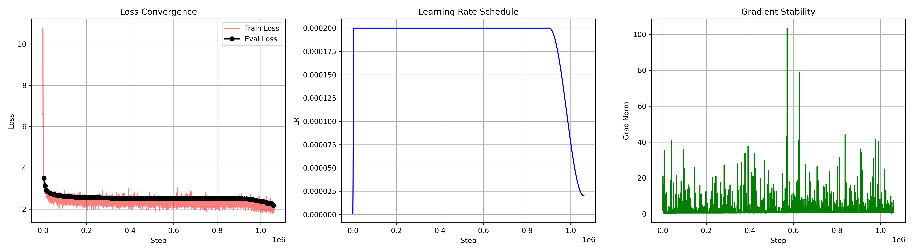
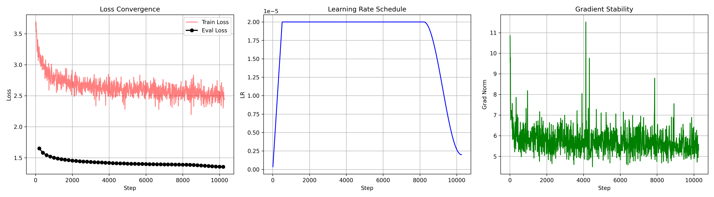

# LLM_350M_DENSE

This is a my first successfull attempt in building small LLM to be able to be +-usefull "chat bot assistant" !

The model is standard Dense Decoder only 350M params model, trained on ~70B tokens (FineEdu, cosmopedia, wikipedia and starcoderdata).

# Hellaswag score: 42%
model dim: 1024
Layers number: 24
Heads number: 16

# Architecture
Tokenizer: EleutherAI/gpt-neox-20b
Positonal Encoder: RoPE
Normalization: RMSNorm
Residual Connnections type: Pre-Norm
LR: 2e-4
Batch Size: 5M tokens

# Graphs Pre-train then Fine-tuneing

And in file text.txt are some examples of converstaions with this Fine tuned model :)

# Model weights

firdavsus/LLM_350M_DENSE
They are open source and come in two folders pretrain/ and finetune/
